# BCR Call Recordings Player

A modern, fast, and feature-rich Material 3 companion player GUI for Basic Call Recorder (BCR) on Android. Designed with premium aesthetics, edge-to-edge screens, fluid animations, and robust system integration.

---

## Screenshots

### Onboarding Flow
| Step 1: Storage Permission | Step 2: Configuration |
| :---: | :---: |
| 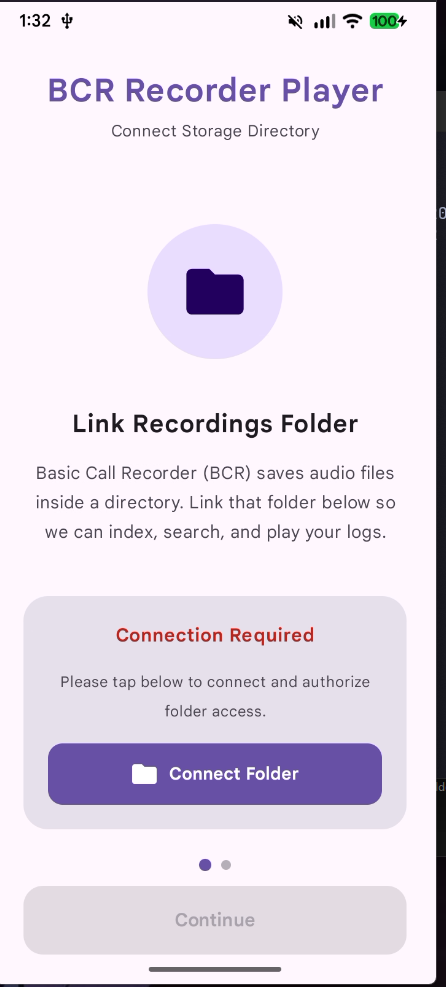 | 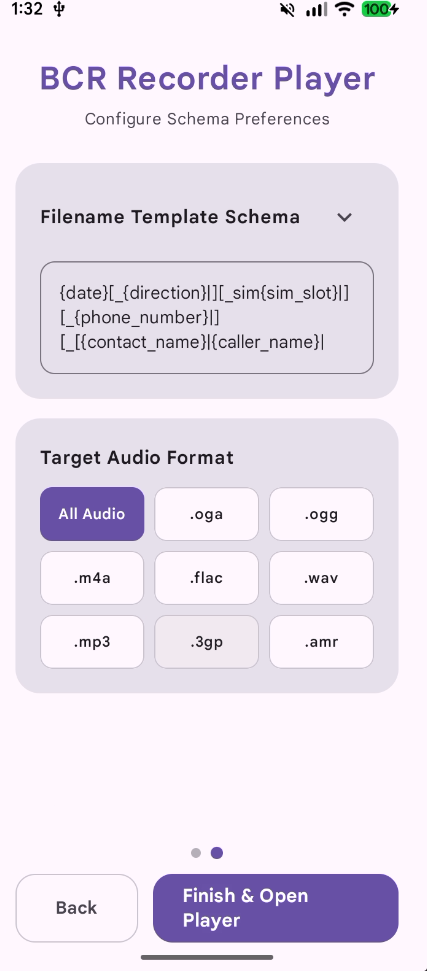 |

### Main Dashboard & List Views
| Modern Dashboard (Light) | Multi-Select & Bulk Actions |
| :---: | :---: |
| 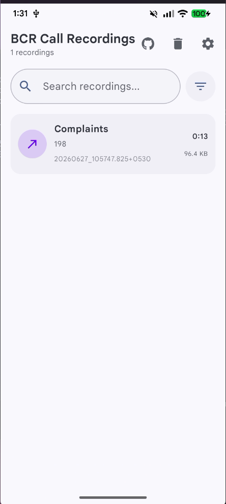 | 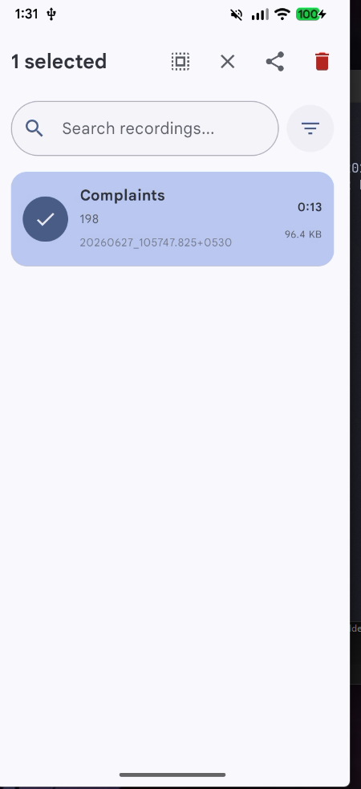 |

| Modern Dashboard (Dark 1) | Modern Dashboard (Dark 2) |
| :---: | :---: |
| 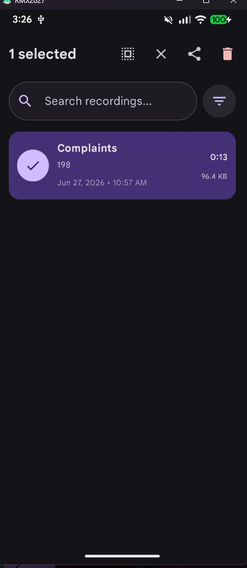 | 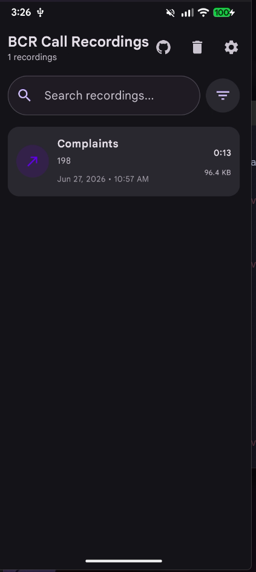 |

### Media Player & Customization
| Floating Collapsed Player | Fullscreen Player (Light) | Fullscreen Player (Dark) | Settings & Customizer |
| :---: | :---: | :---: | :---: |
| 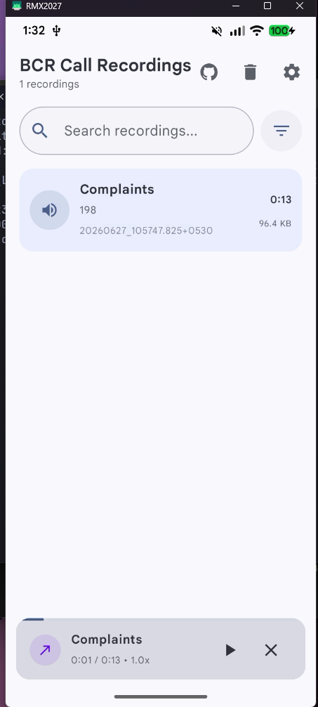 | 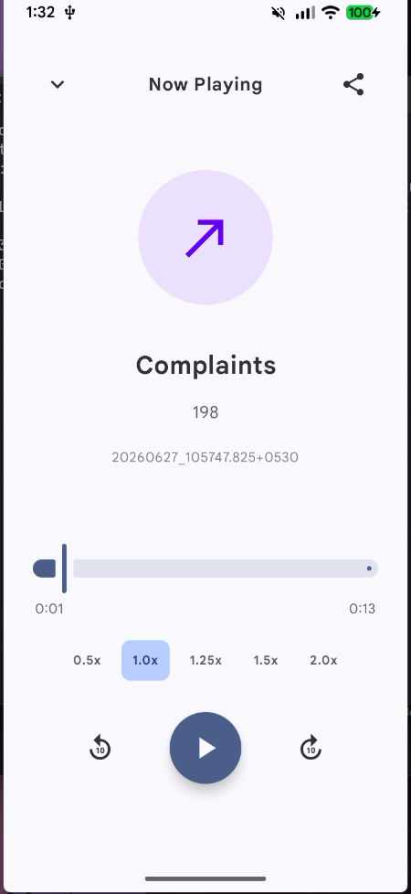 | 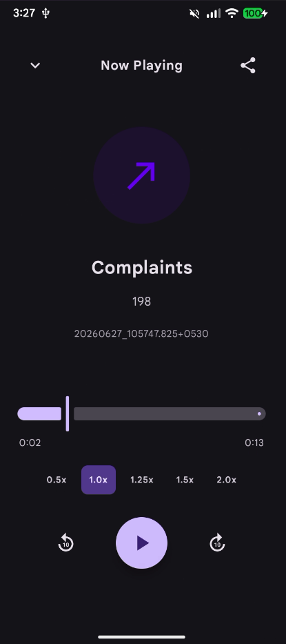 | 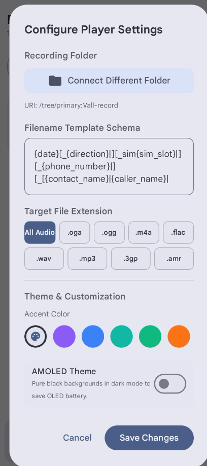 |

### Recycle Bin & Advanced Filters
| Private Recycle Bin | Advanced Filters & Search |
| :---: | :---: |
| 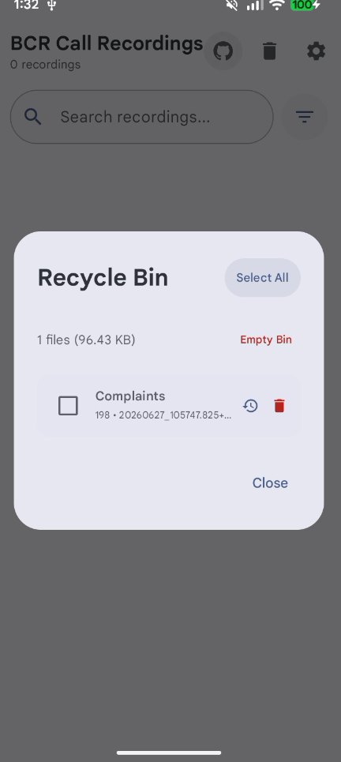 | 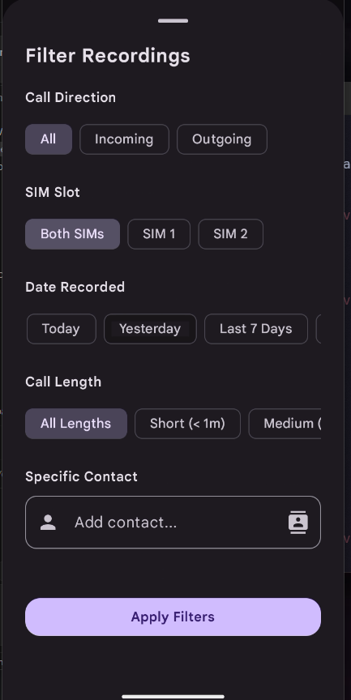 |

---

## Features

- **System Contacts Integration**: Automatically resolves raw telephone numbers into system contact display names dynamically on a background thread.
- **Interactive Floating Player**: Persistent bottom player sheet with speed controls (0.5x - 2.0x), progress slider seeking, 10s skip forwards/backwards, and full landscape optimization (two-column split screen).
- **Private Recycle Bin**: Safely deletes calls by moving audio files and companion JSON files into internal cache storage, allowing bulk restorations or permanent purging later.
- **Advanced Filtering & Search**: Filter call listings by Call Direction (Incoming/Outgoing), SIM Card slot, Minimum duration, Date ranges, and specific multiple contacts.
- **Material You Personalization**: Includes 7 distinct color accents, pure AMOLED pitch-black dark mode, and dynamic system wallpaper matching (Material You) on Android 12+ devices.
- **Contact Suggestions Dropdown**: Custom suggestions search bar dropdown featuring name matching, letter avatars, and input separators.
- **GitHub Actions CI/CD**: Automatic Gradle debug/release APK builds configured on push and pull requests.

---

## Tech Stack

- **Framework**: Jetpack Compose (Kotlin)
- **Design System**: Material Design 3 (M3)
- **Minimum SDK**: API 23 (Android 6.0)
- **Target SDK**: API 37 (Android 15+)
- **Dependency Injection & Jetpack Components**: ViewModels, Flow State Management, Shared Preferences, and SAF (Storage Access Framework) file APIs.

---

## Getting Started

1. Clone the repository:
   ```bash
   git clone https://github.com/ArtRuntime/callrecorder-gui.git
   ```
2. Open the project in Android Studio.
3. Sync Gradle and run on your emulator or physical Android device.
